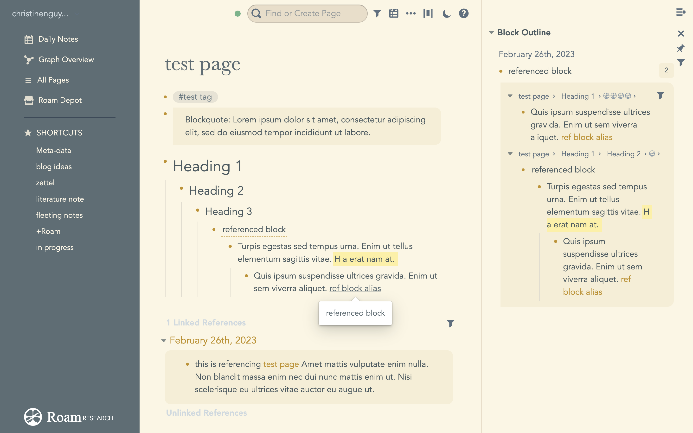
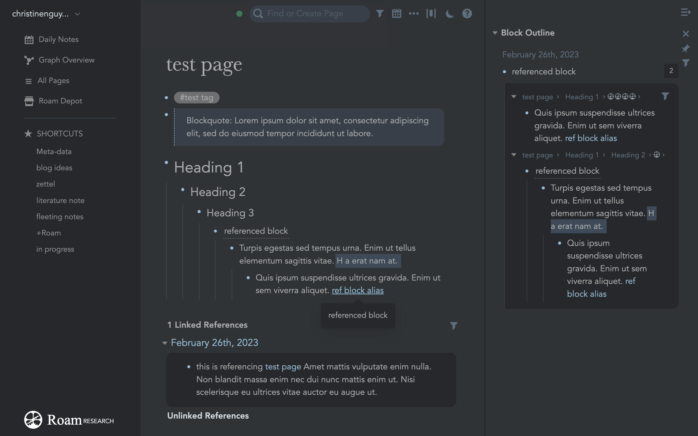

# Bear Pro themes for Roam: solarised light and charcoal

Note-taking experiences should be pleasurable and comfortable. There's little to complain about Roam's function, but its original theme has styling choices that make it uncomfortable to read or write on it for long periods of time. For example, there are not enough spacing between lines, the font size is too small at 100% zoom and there are high contrast colours. The original theme also lacks warmth and joy. These things should be of concern when this app is essentially a writing/research assistant. 

High contrast displays are fine and probably even necessary for daytime viewing. However, to prepare for restful sleep at night, it is recommended surrounding environment light should be dimmed to leave the sleep/wake cycle undisturbed. Assuming someone prefers to view their screen in an environment with low levels of light (even though it's recommended that no screens should be viewed an hour or two before bed), a high contrast display can cause viewing discomfort. (Health sources: Why we sleep, The Sleeping Book, How to be Well)

To address the above concerns, I've chosen to translate Bear Pro's themes solarised light and charcoal across to Roam. These are the lowest conrast themes, and have warmer tones.

## Light theme: Solarised Light



## Dark theme: Charcoal



I slightly modified the original bear colours for charcoal e.g. upping saturation for acccent which i've used for reference pages and links so it's more easily differentiated.

## to-dos

- ### adjustments to increase readability and ease of use
    - ⬜️ realised i've been working with "true tone" activated this entire time. work with true tone off and adjust colours
    - ⬜️ how to structure and name variables so it's easy to swap out colours for duplicate themes. there's structural things that should stay the same like spacing, but colours should be easily editable. 
        - i've given solarised very specific variable names that cannot be used for other themes that don't have the same colour. i've tried to use neutral names denoting a primary, secondary, accent colour - getting there but i'd have to be sure what secondary and accent colours are, which features those colours are assigned to.
    - ⬜️ cannot move down to next block when down arrow is pressed, but can move up 
    - ⬜️ textarea of h1, h2, h3 fields has extra padding or margin or something which makes it an annoying and glitchy typing experience
        - fixed h2 and h3 by adding line-height spec to of level headings eg `.rm-level1, .rm-heading-level-1>.rm-block__self .rm-block__input` but h1 adds inexplicable bottom padding when the block isn't focussed on, padding or space disappears when editing a h1 block
        - ⬜️ textarea in common block (no heading) contracts in space when activated
        - ⬜️ fix alignment of large headings to the bullet point, but actually aligns to baseline ref blocks and center of blockquotes 
        ```
        .roam-block-container .rm-block-main { 
            align-items: baseline;
        }
        ```
    - ⬜️ change hierarchy of reference links to be smaller than "linked references" and unlinked references
    - ⬜️ left sidebar, after clicking on one of the menu items, keep it activated
    - ⬜️ change toast message color
    - ⬜️ not sure how to get rid of the grey background that's already selected through autocomplete result for reference pages or search results or re-style it, or make it disappear if i start using the mouse to hover over options instead of my keyboard
    - ✅ ~~"number of references" heading on right sidebar needs to be same as general text area, it's too dark in charcoal, it's also black in solarised light which is off theme~~
    - ✅ ~~viewed at 100%, the font is way too small, i have to zoom to 150% manually in browser to get to a more comfortable reading size~~
        - reset font sizes to 1.1rem, it seems different components of the app use different sizes
        - ✅ ~~now the left sidebar is relatively too skinny compared to the main body of the app~~
            - set manual width, and `left:` value equals manual width so it disappears completely from view when triggered to do so
        - ⬜️ adjusting font-size for 100% has knocked other things askew like calendar, sliding scale etc
        - ✅ ~~popup over for aliases font-size is still too tiny~~
            - selector: `.rm-alias-tooltip__content`
    - ⬜️ colour of the pop up hover on charcoal needs to be adjusted as it can conflict with other sections with similar coloured background e.g. within section of linked refs
    - ✅ ~~search bar results: no hover styling, formatted in a way that we're unable to see properly~~
        - ~~it disappears once my mouse moves off it, hard to target, not sure what class name is to select it~~
        - target selector `ul.bp3-menu.rm-find-or-create__menu`, `.flex-v-box.rm-menu-item`. these tooltips disappear as soon as the mouse moves off the alias but was finally able to select these by hovering then using keyboard shortcut for "select an element on page inspect it"
    - ✅ ~~heading/page titles: unable to target textarea when editing to get it consistent, so it's switching between serif display and avenir sans-serif when editing, pretty annoying~~
        - `.roam-body .roam-app .roam-main .roam-article .rm-title-editing-display textarea` and `#right-sidebar .rm-sidebar-outline .rm-title-editing-display textarea` targets styling when editing titles
        - ⬜️ a minor issue - but the letters seems to constrict when editing the textarea in main body. In the right sidebar, there's suddenly more room to edit the words
    - ⬜️ for tags, try to disable line-wrap, looks awkward when a background is applied and when a bunch of them are together
    - ⬜️ "unlinked reference" title is too bright in dark theme and off-colour in solarised light, seems to be styled separately from "linked reference", not what I expected
    - ⬜️ caret fix: erratic flickering between colour i've defined and black in code block.. instead of between caret colour and transparent. i've identified these following classes
        ```
        .rm-inline-code-block,
        .ͼ2 .cm-content,
        .ͼ4 .cm-line {
            caret-color: red !important;    
        }
        ```
    - ⬜️ add more breathing room above "Unlinked references" appears not to have its own class, it's just a div, so changing the div will change a whole bunch of other divs
    - ⬜️ test on different browsers. firefox seems to make the fonts thicker instead of fine, also adds its own scrollbar which doesn't fit the theme
    - ⬜️ test on different resolutions (looks hideous in 4k)
    - code clean-up 
        - ⬜️ read more about code structuring
        - ⬜️ do i need so many variations in colours? c
        - ⬜️ consistent use of units - have been doing multiples of 8px but sometimes stay away from that e.g. 20px or 28px
    - ✅ ~~tag background should be fatter - try increasing line-height so they don't cut into each other~~
        - made tags tinier instead and increase line-height of all blocks

- ### adjustments for theme consistency
    - ⬜️ experiment with mashing up solarised light with olive dunk theme, so changing secondary colour teal to olive green from olive dunk
        - thinking green secondary and leaving golden hues for this warm, fresh look that reminds me of a vegetable garden, 
    - ⬜️ increase border radius of tooltip alias
    - ✅ ~~"All Pages" title - adjust table heading colours~~
    - ✅ ~~adjust the highlight colour for solarised theme - it's lighter and more desaturated in the actual Bear app #f0e8d0 => hsl(45 52% 88%)~~
        - still deciding what I like best
    - ✅ ~~change colour of border when bullet is expanded~~
    - change colour of checkmark when completed to match theme
    - ✅ ~~highlighting a complete code block (with all nested elemenets if there are any) is different to highlighting within a code block. it's a deep blue. how to target to change??~~
        - `.block-highlight-blue` targets complete block colour selection
    - ✅ ~~bullet border colour in sidebar seems to be different than border in the main app area~~
        - `.sidebar-content .rm-bullet.rm-bullet--closed .rm-bullet__inner` targets sidebar bullets

- ### other adjustments
    - ⬜️ subtle border change when focussing a search text area
    - ⬜️ hovering over a block reference retains a border at the bottom - bit weird
    - ⬜️ reference blocks come with an underline by default. this is a problem when reference a block that is just an iamge as the underline goes right through (note to self: see entry on Bellinger's System Thinking as an example)
    - ⬜️ in logseq there's a more noticeable fade when hovering over each navigation item in left sidebar, need to experiment with timing in Roam
    - ⬜️ disable background change when hovering over roam research - or expand clickable area, looks bad that square chunk, and it doesn't transition properly ... may be coded separately from the others, potentially hard coded into html with "style" property


## extra stuff to add
- ⬜️ logseq has a really cool feature where hovering over a reference page brings up a tiny window of the actual page, it's also editable
- ⬜️ some sort of personal menu to add to the existing Roam toolbar (not sure what it's called) to allow myself to make changes e.g. switching between colours for highlighters for example without having to go in and edit the code. the way bear has a menu to let us choose line-height or themes
- ⬜️ more highlight colours for detailed note-taking
- ⬜️ incorporate some of the subtle animations in logseq which increases overall feel of responsiveness, noting that animations can undermine accessibility (mdn says to provide an option to turn off animations)
    - e.g. on hover over a bullet, a border appears and the bullet itself expands larger even if there's no nested content
    - hovering over a checkbox adds a border in the dark theme, in the light theme, it seems like it's slightly expanding 
- ⬜️ ticking a checkbox is accompanied by a strikethrough, much more easily differentiated
- ⬜️ caret 
    - change shape of code blocks to underscore or block to mimic typing on the terminal xD 
    - can we make the caret thicker and more noticeable? maybe use block but influence the block? in bear it seems to be longer than the line-height (or it is at line height?) and it's maybe 2-3px thick? the default caret is so thin
- ⬜️ instead of custom data tags, replace bullet-points associated with certain words or pages with icons from https://tabler-icons.io/ like nmartin84: https://github.com/nmartin84/logseq-flow
- ⬜️ automatically switch from light to dark theme as scheduled with user's system and correspond with the light and dark switch in the UI
- ⬜️ query for "on this day" embedded into each journal entry https://unofficial-logseq-docs.gitbook.io/unofficial-logseq-docs/beginner-to-advance-features/on-this-day-query-page
- ⬜️ some styling for certain elements like roam research logo are hardcoded into the html page under "style" attribute. could be possible to swap this out or influence the look with JS??
- ⬜️ make every even row of table on "All Pages" a different colour 
    ```
    .rm-all-pages .table .rm-pages-row.rm-pages-row-header {
        background-color: ;
        color: ;
    }
    ```
- ⬜️ changing hover effect of links and tags, not a fan of text underline as it's too close to the words. targeting the hover pseudo-selec both normal links and tags 
    ```
    .rm-page-ref:hover { 
        text-decoration: none;
    }
    ```
- ⬜️ reproduce olive theme from Bear for fresher feel

## What I've learnt from trying to code my own theme


- investigating how to properly sync Git, GitHub, and GitHub Desktop
- utilising css variables
- familiarising myself with devtools and reading through someone else's code, understanding it enough to make my own modifications
- getting to see a bit more into the inner workings of roam - a software i use daily
- paying attention to the details in someone else's design (Bear Pro themes) and translating it another context, playing around with what works and what doesn't
- documentation and keeping progress. getting more familiar with using markdown for notes to self, striving for better commit summaries on github not for my own sake but others when working in teams
- finding better coding dev practices or workflows for accuracy and ease (I'm using a clunky workflow: identifying correct selectors and observing changes in dev tools, sometimes editing directly in stylus if I can't make changes directly in dev tools, copying over into VS code when I'm sure about the changes I wanted to make)
- learning how to better organise huge chunks of code for readibility (not just for teams, but myself when going back to edit code) including how to name aspects or features of the website ... Roam is a complicated piece of software
- attention to detail matters